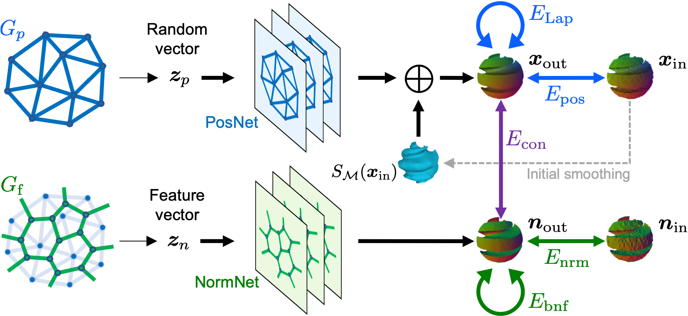

# Dual Deep Mesh Prior

## One-shot Mesh Denoising with Self-supervised Dual Graph Convolutional Networks




___

## Getting Started


### Installation
```
git clone https://github.com/astaka-pe/Dual-DMP
cd Dual-DMP
conda env create -f environment.yml
conda activate ddmp
```

### Preparation

The Dataset is distributed as a zip file. Please unzip and place it under Dual-DMP directory. 

## Training

### CAD model

```
python main.py -i datasets/fandisk --k1 3 --k2 0 --k3 3 --k4 4 --k5 2 --bnfloop 5
```

### Non-CAD model
```
python main.py -i datasets/ankylosaurus
```

### Real-scanned model
```
python main.py -i datasets/pyramid --iter 50
```

Outputs are generated under "datasets/{model-name}/output/" with their MAD scores.

## Training with your own data
Place a noisy mesh and a ground-truth mesh under "datasets/{model-name}/" .
- Noisy mesh: "{model-name}-noise.obj"
- Ground-truth mesh: "{model-name}-gt.obj"

Run 
```
python preprocess/preprocess.py -i datasets/{model-name}
```
for edge-based normalization and creating initial smoothed mesh.

Finally, run
```
python main.py -i datasets/{model-name}
```
You should set appropriate weights as discribed in the paper.

## If you don't have ground-truth data
After runnning `preprocess.py`, run
```
python main4real.py -i datasets/{model-name}
```