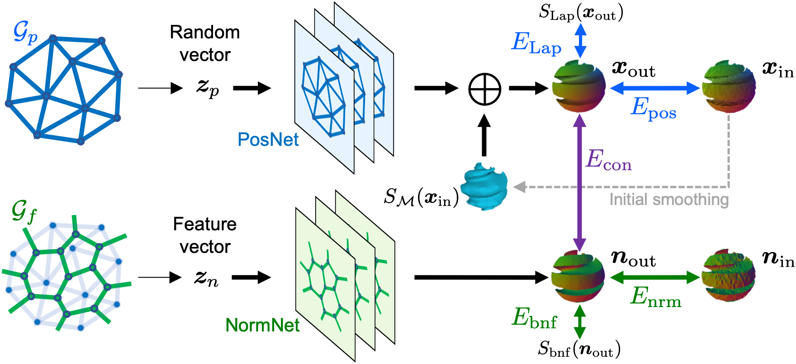
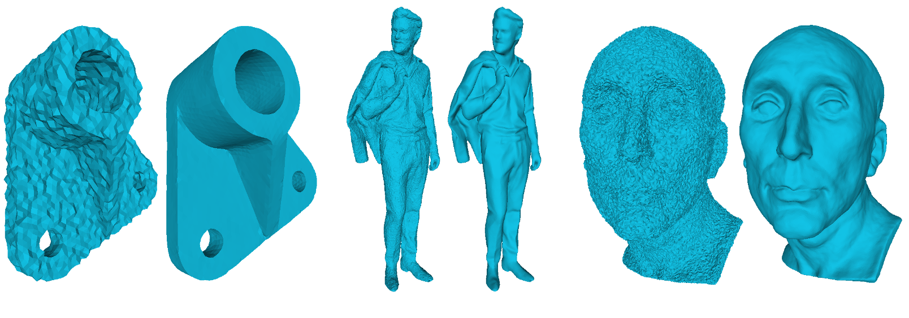

# Dual Deep Mesh Prior

## Learning Self-prior for Mesh Denoising using Dual Graph Convolutional Networks
Paper accepted by [ECCV2022](https://eccv2022.ecva.net/program/accepted-papers/#:~:text=Yu%20(ETH%20Zurich)-,4934,-Learning%20Self%2Dprior).


### Method Overview



### Results



___

## 1. Getting Started


### 1.1 Installation
```
git clone https://github.com/astaka-pe/Dual-DMP
cd Dual-DMP
conda env create -f environment.yml
conda activate ddmp
```

#### Tested environment
- Ubuntu 20.04
- NVIDIA GeForce TITAN X (12GB)

### 1.2 Preparation

The Dataset is distributed as a zip file. Please unzip and place it under Dual-DMP directory. 

## 2. Training

- CAD model

```
python main.py -i datasets/fandisk --k1 3 --k2 0 --k3 3 --k4 4 --k5 2 --bnfloop 5
```

- Non-CAD model
```
python main.py -i datasets/ankylosaurus
```

- Real-scanned model
```
python main.py -i datasets/pyramid --iter 50
```

Outputs will be generated under `datasets/{model-name}/output/` with their MAD scores.

___
## Appendix
### Training with your own data
Place a noisy mesh and a ground-truth mesh under `datasets/{model-name}/` .
- Noisy mesh: `{model-name}_noise.obj`
- Ground-truth mesh: `{model-name}_gt.obj`

Run 
```
python preprocess/preprocess.py -i datasets/{model-name}
```
for edge-based normalization and creating initial smoothed mesh.

Finally, run
```
python main.py -i datasets/{model-name}
```
You should set appropriate weights as discribed in the paper.

### Training without using ground-truth data
After runnning `preprocess.py`, run
```
python main4real.py -i datasets/{model-name}
```

### Creating noisy data
Run
```
python preprocess/noisemaker.py -i datasets/{model-name}/{model-name}.obj --level {noise-level}
```
